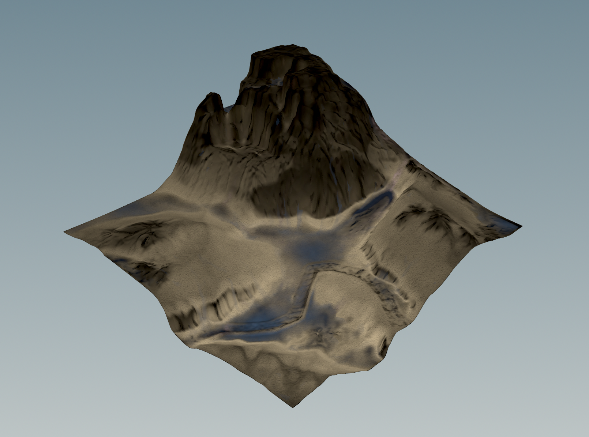
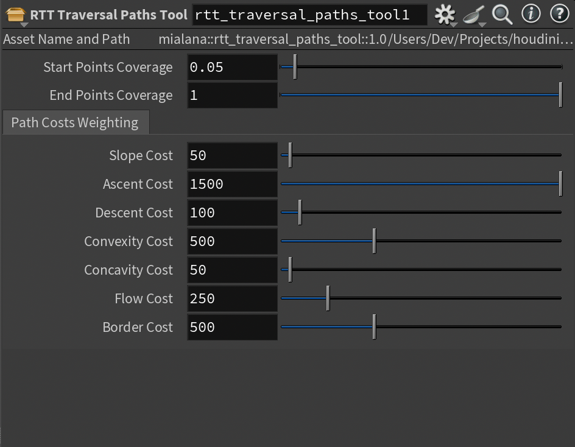

# Houdini Ruins Terrain Toolset

## Overview
A comprehensive toolset for creating ruined terrains in Houdini. Created for SideFX's [2025 Game Art Challenge](https://www.sidefx.com/community-main-menu/contests-jams/2025-game-art-challenge/) in the Game Art Tool category.

The toolset is created solely in native Houdini -- textures and materials are built in Copernicus and material networks, and geometry assets in included HDA networks. All HDAs can be ported to Unity and Unreal. Everything is 100% procedural.

## Contents

### "Hero":
- RTT Main Terrain

### Tools:
- RTT Traversal Paths Tool
- RTT Layered Fracture Tool
- RTT Flooded Water Tool
- RTT Terrain Blockout Tool

### Assets:
- RTT Decayed Rock Wall Asset
- RTT Fractured Column Asset
- RTT Terrain Rocks Asset

### Demonstrated Tool Interactions:
- Piled ruins geometry (RBD collision + scattering) on *Main Terrain* 
- Traversing vines and ropes using *Traversal Paths Tools*

## Application Versions
- Houdini 20.5
- Unity 6.1 or Unreal 5.4
    - **Note:** A commercial Houdini license is required for usage of the toolset in these platforms. Read about the [Houdini Engine](https://www.sidefx.com/products/houdini-engine/) for more info.

## Quick Start
The quickest way to get started is to download / clone this repo to your local desktop, and open up the `./Houdini/Examples/main-terrain.hiplc` file.

This file contains example usage of every tool, asset, and tool interaction listed above.

## Toolset Preview Images and Brief Descriptions

### RTT Main Terrain
Unity:

Houdini:

### RTT Traversal Paths Tool

- This tool procedurally creates paths across the terrain based on given weights. While it has a variety of use cases, demoed in this project is a flooded water layer in the terrain, as well as traversing vines and ropes geometry.

### RTT Layered Fracture Tool

- A custom fracturing tool for stone structure assets in ruins environments. Demonstrated above on the RTT Fractured Column Asset.

### RTT Flooded Water Tool

- A tool that simulates the look and geometry of a ruined terrain that has been flooded.
- The flooded water layer geometry is separate from the rest of the terrain geometry. This is especially useful when ported to Unity and other game engines, as it can (not) have separate "collider" component logic, or displacement shader logic.

### RTT Terrain Blockout Tool

- A simple tool with 4 different options to create geometry for shaping the look of the RTT Main Terrain heightfield.

### Tool Interactions

#### Piled Ruins Geometry Interaction Demo

- This demo is encapsulated in the "RTT Rigid Body Collider Interactor" HDA.

#### Traversing Vines and Ropes Interaction Demo

- This demo is included in the above-mentioned main example HIP file.

### Assets

#### Decayed Rock Wall

- Uses masking logic on wall height with a cutoff threshold to selectively delete from the wall geometry, regardless of the slope and curvature of the input curve.
- Example usage in the main HIP file for lining a terrain path with the RTT Decayed Rock Wall asset. An extra layer of "decay" is created through the `Labs Random Selection` node on the primitive level of the input curve, creating a segmented as well as decayed rock wall for the ruins terrain.

## References

[PROJECT PEGASUS | ROADS, TRACKS AND RIVERS](https://www.sidefx.com/tutorials/project-pegasus-roads-tracks-and-rivers/)

[PROJECT PEGASUS | PILE TOOL](https://www.sidefx.com/tutorials/project-pegasus-pile-tool/)

[Post Apocalyptic Ruins in UE4](https://www.youtube.com/playlist?list=PLXNFA1EysfYkqx3R-WyQHYEYR3c1odJPX)

## SideFX 2025 Game Art Challenge Notes

Thank you for giving me this opportunity to explore such a wide variety of different workflows in Houdini!

Although I have used Houdini for small-scale assignments in my university courses, this contest exponentially increased that learning on the daily.

Access to a Houdini Indie license allowed me to bypass the financial hitches of learning Houdini. Obtaining early-access to **Natsura** gave me an inside window into the (extremely-welcoming) Houdini community. And while I was ultimately unable to incorporate Natsura assets in my personal project because of an OpenCL error in the current MacOS build of Natsura, I enjoyed being able to contribute to an ongoing project by helping record an installation tutorial video for Natsura Mac users. I was also able to log into a Windows machine on my university's network to play around with current Natsura features.

Overall, through this project, I hope to demonstrate an understanding of Houdini node options, VEX programming, and best practices for efficiency and speed.

Lastly, I was a bit short on time and was unable to record a demo video for my project. After judging is finished, I will be adding a filmed demo video and completing the other next steps listed below.

## Next Steps
- [ ] Demo video
- [ ] Copernicus textures and material networks for RTT rock wall, fractured column, and terrain rocks assets.
- [ ] Refined Copernicus textures for RTT Flooded Water Tool geometry.